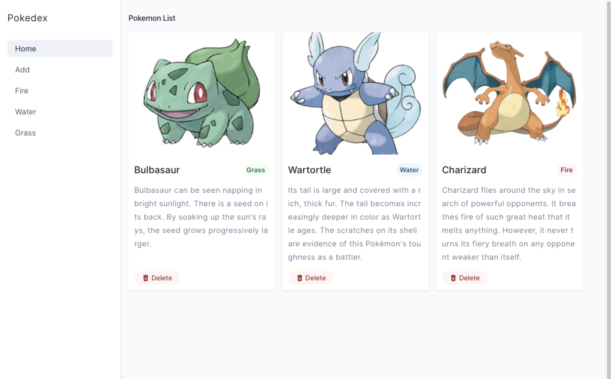
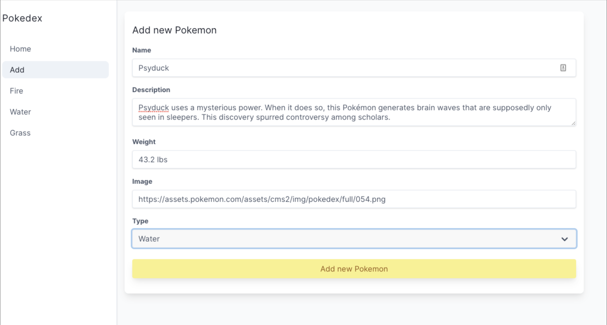
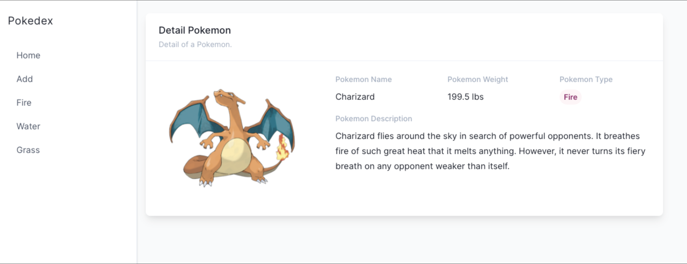
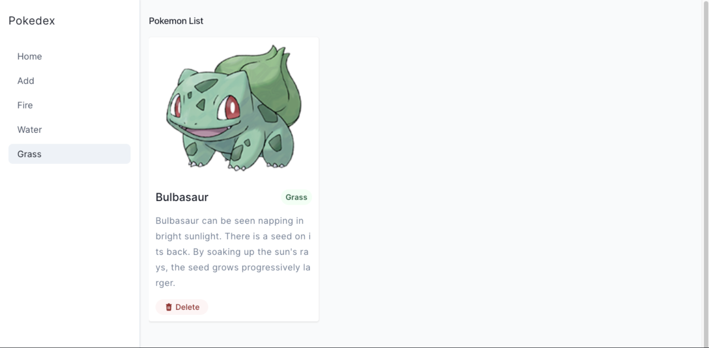
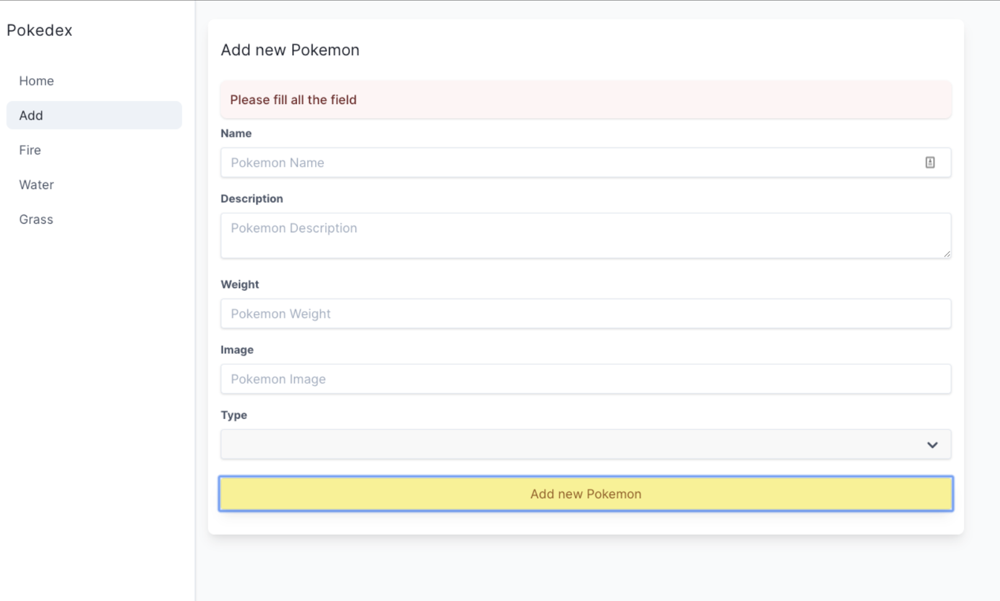

[](https://classroom.github.com/online_ide?assignment_repo_id=13205617&assignment_repo_type=AssignmentRepo)
# FSJSP2S5-LC03 - Pokedex

## Ringkasan

Pada tugas kali ini kalian akan membuat sebuah aplikasi bernama `Pokedex`. Dalam aplikasi ini kalian akan menampilkan berbagai macam `Pokemon`. Kalian juga dapat menambhakan `Pokemon` baru ke dalam list kalian.

## Aturan & Kebijakan

- Waktu Pengerjaan: **180 min** (3 jam)
- Student diharapkan menjunjung tinggi INTEGRITAS. Segala bentuk ketidakjujuran meliputi peniruan, plagiarisme, pemalsuan pengerjaan akan mendapatkan tindakan tegas dari akademik
- Error minimal ditampilkan menggunakan `console.log` di client
- (-10) jika `node_modules` tidak diignore
- (-5) jika `package.json` tidak ada, tidak valid atau tidak dipush
- (-5) jika tidak menyertakan example value `.env` bagi yang menggunakan dotenv
- (-5) Error tidak ditampilkan pada client

## Bobot Penilaian

- Typescript
- NEXT.js
- Reusable Component

## Components

Buatlah client side kalian yang terdiri dari beberapa component-component berikut:

- Home Page
- Navbar
- Pokemon Card
- Add New Pokemon Page
- Pokemon Detail Page
- Pokemon base on Type Page

## Github Live Code Workflow

Dalam pengerjaan live code, kalian diminta untuk melakukan commit sebagai checkpoin pengerjaan. Jika pengerjaan release sudah selesai, segera lakukan `add-commit` dengan message relase yang jelas.

- Contoh 1: git commit -m "Release 0 Done"
- Contoh 2: git commit -m "Release 3 - Fetch: Done"

Instructor juga akan meminta commit dalam waktu tertentu, pastikan kalian melakukan `add-commit` juga ketika instructor meminta melakukan commit.

## Release 0: Setup Project

Silahkan gunakan `json-server` sebagai database pada aplikasi ini. Skema dari aplikasi ini adalah sebagai berikut:

```JSON
{
  "pokemon": [
    {
      "id": 1,
      "name": "Bulbasaur",
      "type": "grass",
      "description": "Bulbasaur can be seen napping in bright sunlight. There is a seed on its back. By soaking up the sun's rays, the seed grows progressively larger.",
      "weight": "15.2 lbs",
      "image": "https://assets.pokemon.com/assets/cms2/img/pokedex/detail/001.png"
    }
  ]
}
```

Pada sisi client, Lakukan setup project dengan menginstall package yang sudah diajarkan sebelumnya:

1. Next.js
2. Typescript
3. Eslint
4. CSS Framework

Pada Live Code ini, kalian dibebaskan membuat design aplikasi yang kalian kerjakan namun pastikan aplikasi memiliki layout yang baik agar mendapatkan nilai maksimal. Setiap release akan terdapat referensi tampilan yang bisa kalian ikuti untuk efisiensi waktu.

## Release 1: Home Page

Buatlah sebuah halaman pada path `/` yang akan menampilkan kumpulan `Pokemon` yang tersedia pada server dan menerapakan client side rendering (CSR).

Pada setiap item terdapat data:

1. Gambar pokemon
2. Nama pokemon
3. Tipe pokemon
4. Deskripsi pokemon



## Release 2: Add New Pokemon

Buatlah halaman baru dengan path `/create-pokemon` yang terdapat sebuah form untuk menambahkan `Pokemon` baru kedalam database. Terapkan client side rendering (CSR). Data yang dapat di input untuk `Pokemon` baru kita adalah:

- Name: `text input` untuk nama pokemon
- Description: `text area` untuk deskripsi pokemon
- Weight: `text input` untuk berat pokemon
- Image (url): `text input` untuk gambar pokemon berupa sebuah url
- Type: `select option` untuk tipe pokemon dengan pilihan: `Fire`, `Water` dan `Grass`.

Pastikan user kembali ke halaman `/` ketika berhasil menyimpan data `Pokemon` dan `Pokemon` yang baru kalian buat akan ada pada halaman `/`

Kalian bisa menggunakan [Website ini](https://www.pokemon.com/us/pokedex) Sebagai referensi Pokemon yang kalian masukkan.



## Release 3: Detail Pokemon

Lakukanlah sebuah action ketika user menekan sebuah item yang berada di halaman utama. Action yang akan dilakukan adalah mengarahkan user ke halaman `/pokemon/:id` yang menampilkan detail dari `Pokemon` yang dipilih oleh user dan pada halaman ini menerapakan server side rendering (SSR).

Data yang ditampilkan pada halaman `/pokemon/:id` adalah:

1. Gambar pokemon
2. Nama pokemon
3. Berat Pokemon
4. Tipe pokemon
5. Deskripsi pokemon



## Release 4: Delete Pokemon

Implementasikan button `delete` pada setiap item di halaman `/` yang akan menghapus data `Pokemon` tersebut pada database. Data yang berhasil dihapus tidak ditampilkan lagi pada kumpulan `Pokemon` di halaman `/`

## Release 5: Filter Pokemon

Buatlah halaman dengan path `/fire`, `/water`. `/grass` untuk menampilkan `Pokemon` yang memiliki type sesuai dengan path yang diminta. Menurut kalian berapa route yang kalian butuhkan untuk menyelesaikan release ini?



## Release 6: Validasi Form Add

Pada release 2, buatlah validasi ketika user ingin membuat pokemon baru dengan rules:

- Semua input harus terisi sebelum menyimpan data ke database, jika ada yang belum terisi, infokan dengan message yang jelas
- Tampilkan sebuah feedback ketika ada data yang belum terisi pada form, feedback ini dapat berbentuk modal atau toast atau package lainnya tetapi tidak diperbolehkan menggunakan fungsi `alert()` javascript.


# next-test-crud
